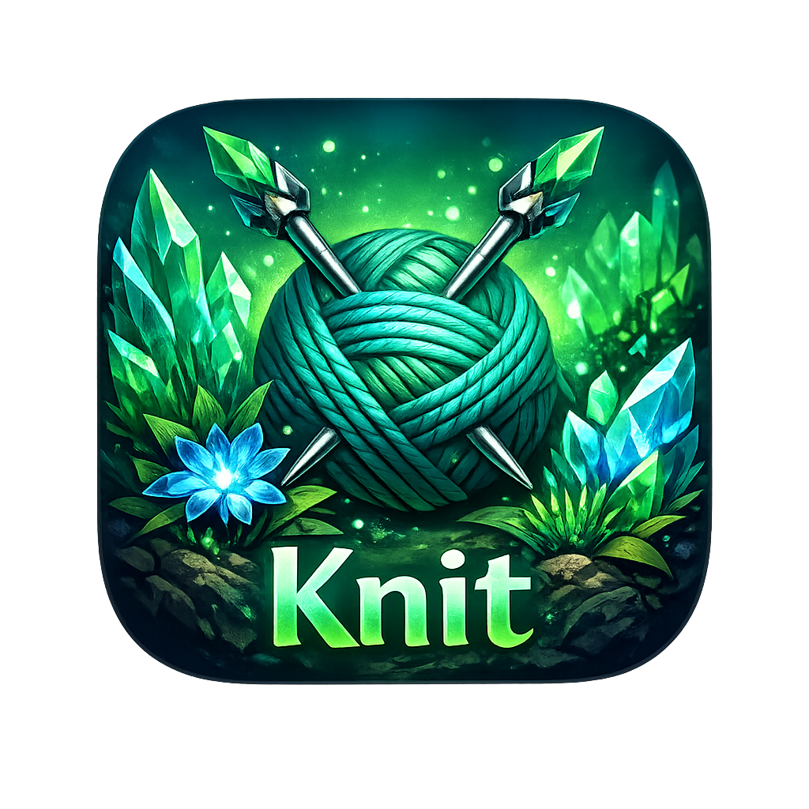

<p align="center">
  
</p>

<h1 align="center">Knit</h1>

<p align="center">
  <strong>🎬 Элегантное приложение для поиска торрентов фильмов и сериалов</strong>
</p>

<p align="center">
  <a href="https://github.com/Cheviiot/Knit/releases"></a>
  <a href="https://github.com/Cheviiot/Knit/blob/main/LICENSE"></a>
</p>

<p align="center">
  <a href="#-установка">Установка</a> •
  <a href="#-особенности">Особенности</a> •
  <a href="#-сборка">Сборка</a> •
  <a href="#-лицензия">Лицензия</a>
</p>

---

## 📦 Установка

### Linux (рекомендуется)

```bash
curl -fsSL https://raw.githubusercontent.com/Cheviiot/Knit/main/install.sh | bash
```

Скрипт автоматически:
- ✅ Скачает последнюю версию
- ✅ Установит иконки
- ✅ Создаст ярлык в меню приложений

**Обновление:**
```bash
curl -fsSL https://raw.githubusercontent.com/Cheviiot/Knit/main/install.sh | bash -s -- --update
```

**Удаление:**
```bash
curl -fsSL https://raw.githubusercontent.com/Cheviiot/Knit/main/install.sh | bash -s -- --uninstall
```

### Ручная установка

Скачайте бинарник из [Releases](https://github.com/Cheviiot/Knit/releases).

---

## ✨ Особенности

- 🔍 **Поиск фильмов и сериалов** — интеграция с TMDB
- 🧲 **Поиск торрентов** — через публичные Jackett серверы (без настройки!)
- ⬇️ **Загрузка в один клик** — отправка в Free Download Manager
- 🎨 **Красивый интерфейс** — тёмная тема, постеры, рейтинги
- 🚀 **Быстрая работа** — Go + Wails v3

---

## 🛠️ Технологии

| Backend | Frontend |
|---------|----------|
| Go 1.24 | Vue 3 |
| Wails v3 | Tailwind CSS 4 |

---

## 🔨 Сборка из исходников

### Требования

- [Go 1.24+](https://go.dev/dl/)
- [Node.js 20+](https://nodejs.org/)
- [Wails CLI v3](https://wails.io/)

### Установка Wails

```bash
go install github.com/wailsapp/wails/v3/cmd/wails3@latest
```

### Разработка

```bash
wails3 dev
```

### Сборка

```bash
wails3 build
```

---

## 📄 Лицензия

[MIT](LICENSE)

---

<p align="center">
  Made with ❤️ by <a href="https://github.com/Cheviiot">Cheviiot</a>
</p>
